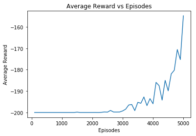
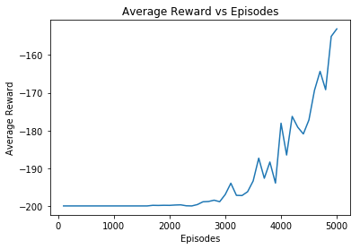

# RL-implementations

A reference repository for implementations of some of the most used Reinforcement Learning algorithm for tutorial purposes.

1. Q-Learning on MountainView-v0 [Reference](https://towardsdatascience.com/getting-started-with-reinforcement-learning-and-open-ai-gym-c289aca874f)  
Results (Average reward vs Num Episodes):  

2. SARSA  
Results (Average reward vs Num Episodes):  

To-Do:  
* DQN  
* DDPG  
* A2C/A3C  
* PPO  
* TRPO  
